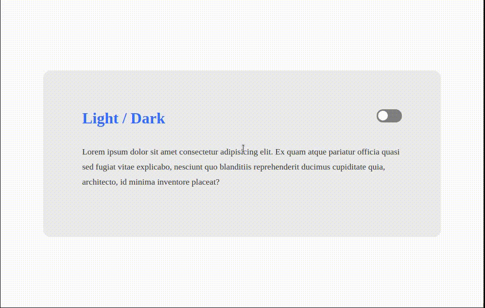
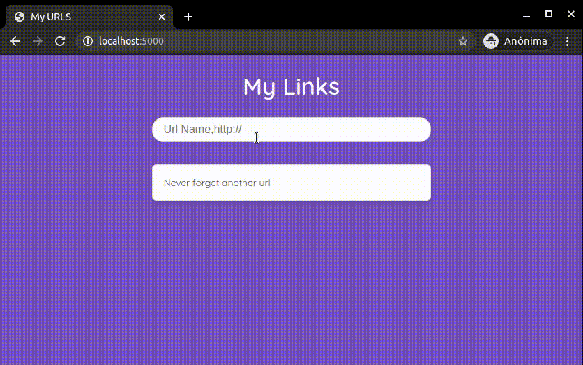
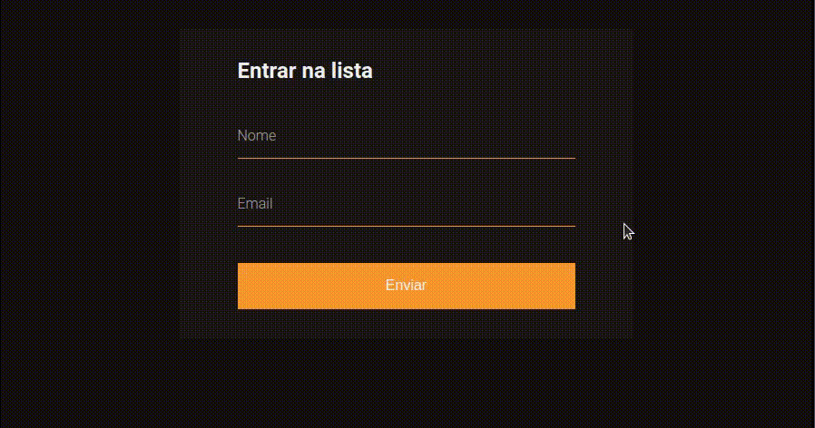
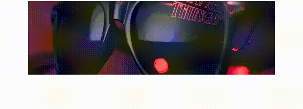

# 🖥 rocketseat-youtube
O canal do youtube da <a href="https://www.youtube.com/channel/UCSfwM5u0Kce6Cce8_S72olg">Rocketseat</a> têm muito conteúdo incrível sobre programação.  
As aulas são super completas e cheio de informações, usarei esse repositório deixar as partes práticas dos conteúdos apresentados nos vídeos.  
Cada pasta é referente a uma aula. 😀

## 🚀 Links das aulas
- <a href="https://www.youtube.com/watch?v=ghTrp1x_1As">O que é API? REST e RESTful? | Mayk Brito</a> 34m
- <a href="https://youtu.be/BvhYm0BOLvA">Dark Mode raiz com CSS e JavaScript | Code/Drops #24</a> 17m
- <a href="https://www.youtube.com/watch?v=HN1UjzRSdBk">Desvendando o CSS Grid na prática | Mayk Brito</a> 36m
- <a href="https://youtu.be/nhW70H9H4gU">Espaçamentos e a mágica do CSS Box Model | Masterclass #10</a> 39m
- <a href="https://www.youtube.com/watch?v=DiXbJL3iWVs">Node.js: Iniciando da teoria à prática | Masterclass #11</a> 1h33m
- <a href="https://www.youtube.com/watch?v=BaI8dHUthLA">Dê super poderes ao CSS com SASS | Masterclass #15</a> 1h10m
- <a href="https://www.youtube.com/watch?v=BwwOu29K6mE">Transição de imagens com CSS3 e JavaScript puro | Code/Drops #26</a> 17m
- <a href="https://youtu.be/mxIhSTP6ddE">Utilizando UX para projetar uma aplicação do zero | Masterclass #09</a> 1h18min
- <a href="https://www.youtube.com/watch?v=GTMEuHxh8aQ">Validação de forms customizada com HTML e JavaScript | Code/Drops #32</a> 1h01m

## 🎯 Gifs de algumas aulas
### Dark Mode raiz com CSS e JavaScript

### Node.js: Iniciando da teoria à prática
Essa página simples foi construida usando Node e os dados estão sendo armazenos em arquivo JSON no back-end.

### Validação de forms customizada com HTML e JavaScript 

### Transição de imagens com CSS3 e JavaScript puro

