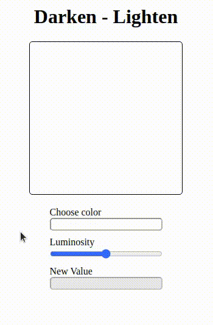

# 🖥 rocketseat-youtube

O canal do youtube da <a href="https://www.youtube.com/channel/UCSfwM5u0Kce6Cce8_S72olg">Rocketseat</a> têm muito conteúdo incrível sobre programação.  
As aulas são super completas e cheio de informações, usarei esse repositório deixar as partes práticas dos conteúdos apresentados nos vídeos.  
Cada pasta é referente a uma aula. 😀

## 🚀 Links das aulas assistidas

- <a href="https://youtu.be/7pqp3IKyC0s">7 Tags HTML que Você Precisa Conhecer</a> 19min
- <a href="https://youtu.be/6TEo2AxW-oQ">Aplicações React do futuro? UI declarativas, design system e frameworks</a> 1h01m
- <a href="https://youtu.be/OyTPNNIy3pc">Criando função Debounce do Zero com JavaScript</a> 32m
- <a href="https://youtu.be/-jXfKDYJJvo">Chat em tempo real com NodeJS + Socket.io</a> 16m
- <a href="https://youtu.be/FsCBw9X9U84">Como usar React Context (com Hooks)</a> 21m
- <a href="https://youtu.be/BvhYm0BOLvA">Dark Mode raiz com CSS e JavaScript</a> 17m
- <a href="https://www.youtube.com/watch?v=HN1UjzRSdBk">Desvendando o CSS Grid na prática</a> 36m
- <a href="https://www.youtube.com/watch?v=BaI8dHUthLA">Dê super poderes ao CSS com SASS</a> 1h10m
- <a href="https://youtu.be/nhW70H9H4gU">Espaçamentos e a mágica do CSS Box Model</a> 39m
- <a href="https://youtu.be/K5yYBJhix5A">Extraindo dados de outros sites com Puppeteer JS</a> 26m
- <a href="https://youtu.be/ZaDpDlPr25M">Expo SDK 38.0 mudou o jogo no React Native</a> 39m
- <a href="https://youtu.be/evBGq29wr08">Manipulando cores hexadecimais com JavaScript puro</a> 44m
- <a href="https://www.youtube.com/watch?v=DiXbJL3iWVs">Node.js: Iniciando da teoria à prática</a> 1h33m
- <a href="https://www.youtube.com/watch?v=ghTrp1x_1As">O que é API? REST e RESTful?</a> 34m
- <a href="https://youtu.be/H91DhKPjhPk">Responsividade na Prática</a> 1h30m
- <a href="https://youtu.be/ngVU74daJ8Y">Tema light/dark com React, Styled Components e TypeScript </a> 33min
- <a href="https://www.youtube.com/watch?v=BwwOu29K6mE">Transição de imagens com CSS3 e JavaScript puro</a> 17m
- <a href="https://youtu.be/mxIhSTP6ddE">Utilizando UX para projetar uma aplicação do zero</a> 1h18min
- <a href="https://youtu.be/Cz55Jmhfw84">Serverless com ReactJS e Next.js na Vercel</a> 33m
- <a href="https://www.youtube.com/watch?v=GTMEuHxh8aQ">Validação de forms customizada com HTML e JavaScript</a> 1h01m
## 🎯 Gifs de algumas aulas

### Dark Mode raiz com CSS e JavaScript

### Node.js: Iniciando da teoria à prática

Essa página simples foi construida usando Node e os dados estão sendo armazenos em arquivo JSON no back-end.

### Responsividade na Prática

Aula sobre responsividade para reforçar conceitos importantes.

### Validação de forms customizada com HTML e JavaScript

Nesta aula usamos o "required" do HTML para validar, porém fizemos algumas alterações em sua aparência.

### Manipulando cores hexadecimais com JavaScript puro

Na criação de sites geralmente precismaos de cores mais claras ou mais escuras da cor principal do site, esta página pode ajudar com isso.  

### Transição de imagens com CSS3 e JavaScript puro

