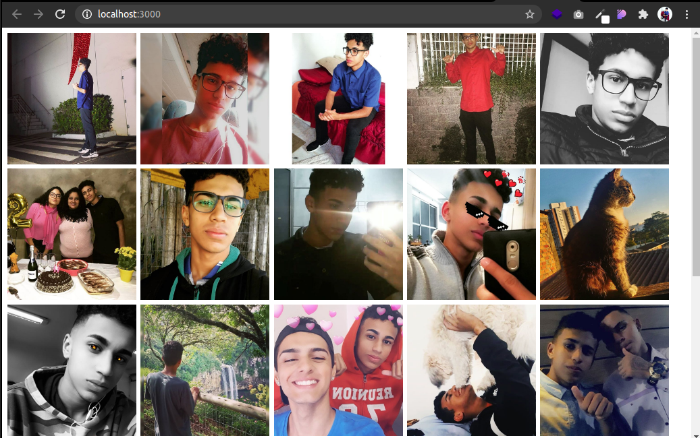

# 🖥 rocketseat-youtube
O canal do youtube da <a href="https://www.youtube.com/channel/UCSfwM5u0Kce6Cce8_S72olg">Rocketseat</a> têm muito conteúdo incrível sobre programação.  
As aulas são super completas e cheio de informações, usarei esse repositório deixar as partes práticas dos conteúdos apresentados nos vídeos.  
Cada pasta é referente a uma aula. 😀

## 🚀 Links das aulas assistidas
- <a href="https://youtu.be/7pqp3IKyC0s">7 Tags HTML que Você Precisa Conhecer | Code/Drops #58</a> 19min
- <a href="https://youtu.be/OyTPNNIy3pc">Criando função Debounce do Zero com JavaScript | Code/Drops #25</a> 32m
- <a href="https://youtu.be/BvhYm0BOLvA">Dark Mode raiz com CSS e JavaScript | Code/Drops #24</a> 17m
- <a href="https://www.youtube.com/watch?v=HN1UjzRSdBk">Desvendando o CSS Grid na prática | Mayk Brito</a> 36m
- <a href="https://www.youtube.com/watch?v=BaI8dHUthLA">Dê super poderes ao CSS com SASS | Masterclass #15</a> 1h10m
- <a href="https://youtu.be/nhW70H9H4gU">Espaçamentos e a mágica do CSS Box Model | Masterclass #10</a> 39m
- <a href="https://youtu.be/K5yYBJhix5A">Extraindo dados de outros sites com Puppeteer JS | Code/Drops #47</a> 26m
- <a href="https://youtu.be/evBGq29wr08">Manipulando cores hexadecimais com JavaScript puro | Code/Drops #35</a> 44m
- <a href="https://www.youtube.com/watch?v=DiXbJL3iWVs">Node.js: Iniciando da teoria à prática | Masterclass #11</a> 1h33m
- <a href="https://www.youtube.com/watch?v=ghTrp1x_1As">O que é API? REST e RESTful? | Mayk Brito</a> 34m
- <a href="https://youtu.be/H91DhKPjhPk">Responsividade na Prática | Masterclass #08</a> 1h30m
- <a href="https://www.youtube.com/watch?v=BwwOu29K6mE">Transição de imagens com CSS3 e JavaScript puro | Code/Drops #26</a> 17m
- <a href="https://youtu.be/mxIhSTP6ddE">Utilizando UX para projetar uma aplicação do zero | Masterclass #09</a> 1h18min
- <a href="https://www.youtube.com/watch?v=GTMEuHxh8aQ">Validação de forms customizada com HTML e JavaScript | Code/Drops #32</a> 1h01m

## 🎯 Gifs de algumas aulas

### Extraindo dados de outros sites com Puppeteer

Aqui usamos o puppeteer para pegar as imagens do meu instagram e colocar no site.
Isso pode parecer bem simples, mas eu achei muito legal, com o puppeteer podemos entrar em qualquer site da web e pegar informações e fazer diversas ações.
Parece um robô, quando surgir um tempo pretendo me aprofundar um pouco mais nessa ferramenta, achei super divertido.

### Dark Mode raiz com CSS e JavaScript

### Node.js: Iniciando da teoria à prática
Essa página simples foi construida usando Node e os dados estão sendo armazenos em arquivo JSON no back-end.

### Responsividade na Prática
Aula sobre responsividade para reforçar conceitos importantes.

### Validação de forms customizada com HTML e JavaScript
Nesta aula usamos o "required" do HTML para validar, porém fizemos algumas alterações em sua aparência.

### Manipulando cores hexadecimais com JavaScript puro
Na criação de sites geralmente precismaos de cores mais claras ou mais escuras da cor principal do site, esta página pode ajudar com isso.  

### Transição de imagens com CSS3 e JavaScript puro

